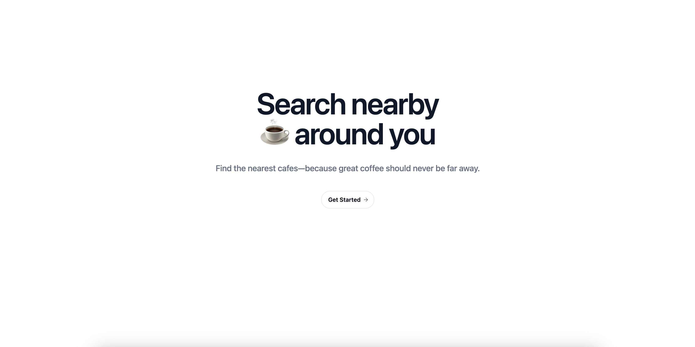
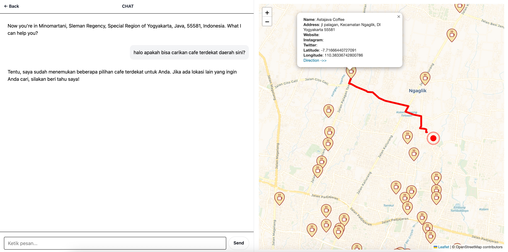
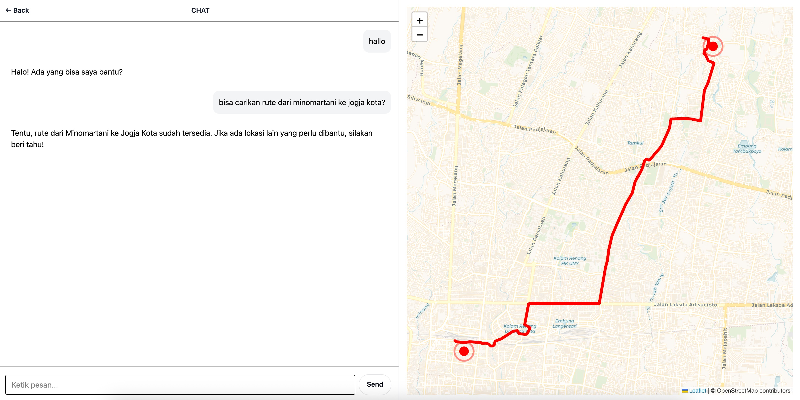

# Nearby Cafe

🌍 A modern and minimalistic frontend for the Nearby Café project – a smart café locator powered by AI, OpenStreetMap, and geolocation features.






## 🔥 Built With
- [Svelte](https://svelte.dev/)
- [TailwindCSS](https://tailwindcss.com/)
- [Leaflet](https://leafletjs.com/)
- [OpenStreetMap](https://www.openstreetmap.org/)
- [Fetch API](https://developer.mozilla.org/en-US/docs/Web/API/Fetch_API)

## 🧠 Features

- **Realtime user geolocation** (HTML5 Geolocation API)
- **Interactive map** with markers for nearby cafés
- **Finding route** on user interaction
- **AI-powered natural language search** (via backend)
- **Dynamic map updates** on user interaction

## 📦 Getting Started

### 1. Clone the repo
```bash
git clone https://github.com/ahmadrockets/nearby-cafe-frontend.git
```
### 2. Install depedencies
```bash
npm install
```
### 3. Set environment variables
Copy `.env.example` to `.env` and configure:
```bash
# Backend api url
PUBLIC_API_URL=http://localhost:3000

# Default init location
PUBLIC_DEFAULT_LATITUDE=-8.3814858,
PUBLIC_DEFAULT_LONGITUDE=110.4595478
```
### 4. Run dev server
```bash
npm run dev
```
App will be run in: http://localhost:5173

### 5. Backend Repo
- [Backend Github Link](https://github.com/ahmadrockets/nearby-cafe-api)